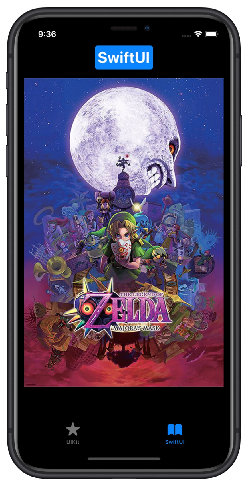

# Zoom gesture SwiftUI (pan+pinch -drag/magnification)


Here an attempt to create a native SwiftUI way to zoom into an image (or View), also a UIKit way to do it with UIKit gestures without UIScrollView.

<p align="center">
 
</p>   
<p align="center">
 http://www.youtube.com/watch?v=kpZQ8b98mns
</p> 


### Differences UIKit method vs SwiftUI method:

| UIKit                                                | SwiftUI                                        |
| ---------------------------------------------------- | ---------------------------------------------- |
| Usage: wrap the view to zoom and add some @State var | Usage: just apply a modifier to a view to zoom |
| Pinch to zoom in and out                             | Double tap to zoom in and out                  |
| Double tap anywhere to zoom in and out               | Double tap anywhere to zoom in and out         |
| Pinch + pan at the same time                         | Magnification + drag **not** at the same time  |


### Usage: 

##### SwiftUI method

```swift
//NukeUI image
LazyImage(source: "https://exlibris.azureedge.net/covers/4033/7056/8766/1/4033705687661xxl.jpg", 
           resizingMode: .aspectFit)
   .zoomable() //Custom SwiftUI modifier
```

##### UIKit method

```swift

//ZoomContainerUIKit give us the offset, scale and anchor
ZoomContainerUIKit(scale: $scale, offset: $offset, scaleAnchor: $scaleAnchor){
  //NukeUI image
  LazyImage(source: "https://exlibris.azureedge.net/covers/4033/7056/8766/1/4033705687661xxl.jpg", 
            resizingMode: .aspectFit)
}
.scaleEffect(scale, anchor: scaleAnchor)
.offset(x: offset.x, y:offset.y)
```

There are some small bugs to fix, you are welcome to collaborate.

